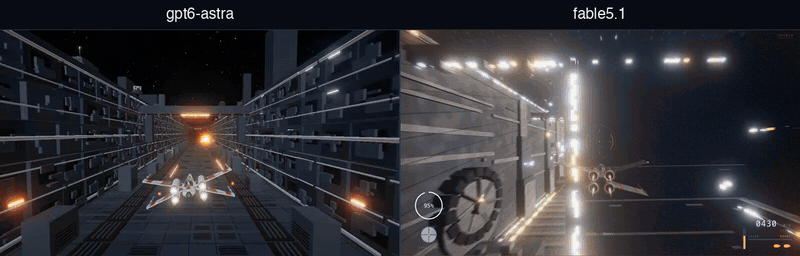

# fable51-worlds

**Worlds as code. A prompt in, a world you can walk out.**

[Claude Fable 5.1](https://www.anthropic.com/claude/fable) agent swarms take a brief - a sentence, a photograph, a clip - then research the place, model it, render it, and check it. What ships is a plain [Three.js](https://threejs.org) app that opens in a browser.

No game engine. No proprietary 3D tiles. No downloaded meshes. Every building, storefront, sign, tree and traffic light is generated by code that lives in this repo.

---

## Worlds

Every entry is a one-shot result. Where GPT-6 Astra was given the same brief, its world was filmed to the Fable walkthrough's camera route and shot timing, and the two run side by side, unedited - **left GPT-6 Astra, right Claude Fable 5.1**.

### 🌉 [Union Square, San Francisco](union-square-sf/)

▶ **[Watch the head-to-head](union-square-sf-gpt-astra/media/fable51-vs-gpt6-astra-union-square.mp4)** · 59 s · left **GPT-6 Astra**, right **Claude Fable 5.1** · [Fable 5.1 build](union-square-sf/) · [GPT-6 Astra build](union-square-sf-gpt-astra/) · Fable alone: **[the walkthrough](union-square-sf/media/union-square-walkthrough.mp4)** (1920×1080 - aerial, plaza, Nintendo, lower level, Apple)

### ⛩️ [Higashiyama, Kyoto](kyoto-higashiyama/)

▶ **[Watch the head-to-head](kyoto-higashiyama-gpt-astra/media/fable51-vs-gpt6-astra-kyoto.mp4)** · 53.9 s · left **Codex / GPT-6 Astra**, right **Claude Fable 5.1** · [Fable build](kyoto-higashiyama/) · [Codex source and viewer](kyoto-higashiyama-gpt-astra/) · Fable alone: **[the walkthrough](kyoto-higashiyama/media/kyoto-higashiyama-walkthrough.mp4)** (1920×1080 - seven scenes, Gion to Kiyomizu-dera at sunset) · [full Codex walkover GIF](kyoto-higashiyama-gpt-astra/media/kyoto-higashiyama-codex-walkover.gif)

### 🌌 [Death Star Trench Run](death-star-trench-run/)

▶ **[Watch the head-to-head](death-star-trench-run-gpt-astra/media/fable51-vs-gpt6-astra-trench-run.mp4)** · 28.2 s · left **GPT-6 Astra**, right **Claude Fable 5.1** · input: **a clip from a film** · [Fable 5.1 build](death-star-trench-run/) · [GPT-6 Astra build](death-star-trench-run-gpt-astra/) · [method](death-star-trench-run-gpt-astra/media/COMPARISON.md) · Fable alone: **[the reel](death-star-trench-run/media/trench-run.mp4)** (1280×720 - approach, S-foils, interception, dive, trench run, torpedoes, fireball, shockwave) · [the brief](death-star-trench-run/PROMPT.md)

*More worlds coming.*

---

## Any input → a world

Text, video or image. The brief names the **subject** and the **style**, and the same pipeline runs behind all three.

| Input | A brief looks like | The world that comes back |
|---|---|---|
| 📝 **Text** | "Hanamikoji, Kyoto - as a hand-painted anime background" | A named place in a named style: real geometry on surveyed ground, with the look written to order |
| 🎞️ **Video** | a clip from a film | The set behind the shot, continued past the edges of frame - step off the camera path and fly the rest of it. See [Death Star Trench Run](death-star-trench-run/) |
| 🖼️ **Image** | one photograph, any angle | The place in the frame as geometry: turn around, change the hour, light it differently |

Style is as open as subject. The same street can come back as a cel-shaded anime plate, a photographic reconstruction or a night scene, because each world's renderer is written for it rather than chosen from a list.

---

## Roadmap

A world is the substrate. What stands on it is the point.

| | | |
|---|---|---|
| ✅ | **Interactive scenes** | Real places, walkable in a browser - this repo |
| 🔜 | **Animation and video** | Motion as code: shot lists, camera language and continuity held across a sequence minutes long, cut from the world itself rather than generated frame by frame - anime, and documentary camera-matched to the real location |
| 🔜 | **Agent environments** | Worlds as training and evaluation environments, where the same code that builds the place also supplies the reward and the verification signal - and, played straight, an RPG |
| 🔜 | **4D, embodiment, robotics** | Scenes that change over time, and simulation where the ground truth comes free with the geometry |
| 🔜 | **Test-time scaling performance** | Measure how world quality changes with more inference time and compute |

---

## How these are made

Every stage is in the repo, and every stage can be re-run:

1. **Reconnaissance** - parallel research agents pull map geometry, elevation, transit and street specs, and a storefront census, each fact carrying its source and a confidence level.
2. **Asset generation** - scripts emit the kit a world needs: façade modules, street furniture, vehicles, vegetation, fixtures. Some worlds ship no binary assets at all and draw every texture at start-up.
3. **Runtime** - a pure Three.js app assembles terrain, streets, façades, props, crowds and traffic from JSON specs.
4. **Verification** - Playwright drives the real app, screenshots fixed viewpoints, and diffs them against photographs taken from the same spot. Independent reviewer agents - architect, geographer, technical artist, interaction - file reports that drive the next fix cycle. **Builders never grade their own work**, and every world ships its own QA report, defects included.

---

## Why code

A world written as code is not the same kind of object as a world generated as pixels or held in a latent space.

| | |
|---|---|
| **Verifiable** | You can check it by running it. Every elevation in Higashiyama is an independent survey query; a walker drives the real movement code over the whole route; Playwright diffs fixed viewpoints against photographs taken from the same spot. A wrong number is a failing test, not a matter of taste. |
| **Compositional** | The parts are reusable and legible. A townhouse generator, a roof kit, a street-plot layout engine - each is a module with a contract, and a district is a few hundred lines that calls them. |
| **Editable** | "Make the shopfront recesses deeper" is a diff, not a re-roll. The world changes exactly where you asked and nowhere else, and the change survives into every later render. |

## License

Code and generated assets: [MIT](LICENSE). Geometry is derived from [OpenStreetMap](https://www.openstreetmap.org/copyright) (ODbL), USGS 3DEP (public domain) and the GSI elevation service. Reference photographs are not redistributed here - provenance is recorded per world. Brand names and logos identify the real businesses at their real locations and belong to their owners.

[Death Star Trench Run](death-star-trench-run/) is an unaffiliated homage. *Star Wars*, X-wing, TIE fighter and the Death Star are trademarks of Lucasfilm Ltd. No film footage, audio, models or textures are used or redistributed here - the reference clip informed the shot list and the look, and every asset in that world is generated procedurally by the code beside it.
