# Death Star Trench Run - a playable cinematic

The Battle of Yavin as a real-time browser experience: a 3 minute 12 second cinematic
that runs on **Three.js** alone, with the trench run itself playable. A 100 km battle
station, a 30 km trench cut along a great circle, an X-wing that holds up two metres from
the lens, and a six-stage destruction sequence. **No textures, no model files, no
downloaded assets** - every panel line, greeble, star and fireball is generated by code in
this directory.

<a href="media/trench-run.mp4">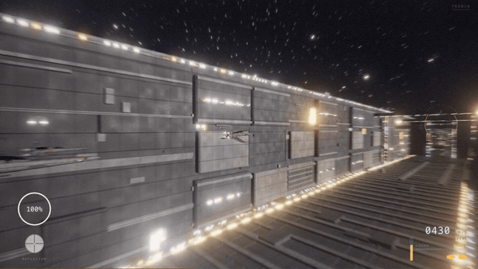</a>

<sub>▶ **[Watch the 28-second reel](media/trench-run.mp4)** (1280×720) - approach, S-foils, TIE intercept, dive, trench run, targeting, torpedoes, fireball, shockwave</sub>

```bash
npm install
npm run dev     # http://localhost:5190
```

`W A S D` / arrows steer · `Q` `E` roll · `Shift` boost · `Space` lasers · `F` proton torpedoes · `C` autopilot · `P` pause · `F3` perf overlay

Two ways in, from the splash: **Launch** puts you in the trench with everything before and
after playing cinematically, **Cinematic** plays the whole thing hands-off.

---

## The input was a clip from a film

This world's brief is a film sequence rather than a place. The pipeline is the same one the
other worlds use, pointed at a shot list instead of a map: research the sequence, model what
the camera sees, write a renderer for the look, then verify it frame by frame. What comes
back is not a video of the clip - it is the sequence rebuilt as code, so the camera can leave
the cut, the trench continues past the edges of frame, and you can fly it yourself.

The brief is reproduced verbatim in [`PROMPT.md`](PROMPT.md).

---

## What you can do

| | |
|---|---|
| **Fly the trench** | 21 km of corridor at 430 m/s, boost to 640, with walls, spans and machinery you can hit |
| **Fight** | Four wing cannons with convergence, wall and deck turbolasers that track and lead you, TIE fighters that make head-on passes |
| **Take the shot** | A targeting phase that locks the exhaust port, then two proton torpedoes that curve into the shaft |
| **Watch it end** | A six-stage destruction: internal failure, core ignition, structural break-up, the fireball, the shockwave, then a cooling debris field |
| **Hand it over** | `C` toggles autopilot mid-run; the whole 3:12 also plays as an autonomous demo with no input at all |
| **Check the work** | `window.__demo` seeks the sequence with a fixed timestep, parks a free camera anywhere, and reports phase, shot, draw calls and triangles |

<p align="center">
  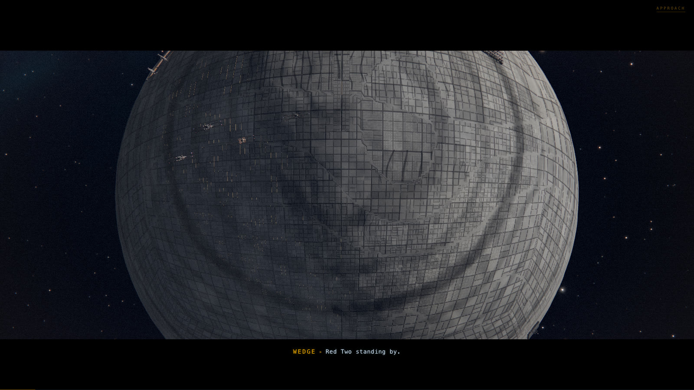
  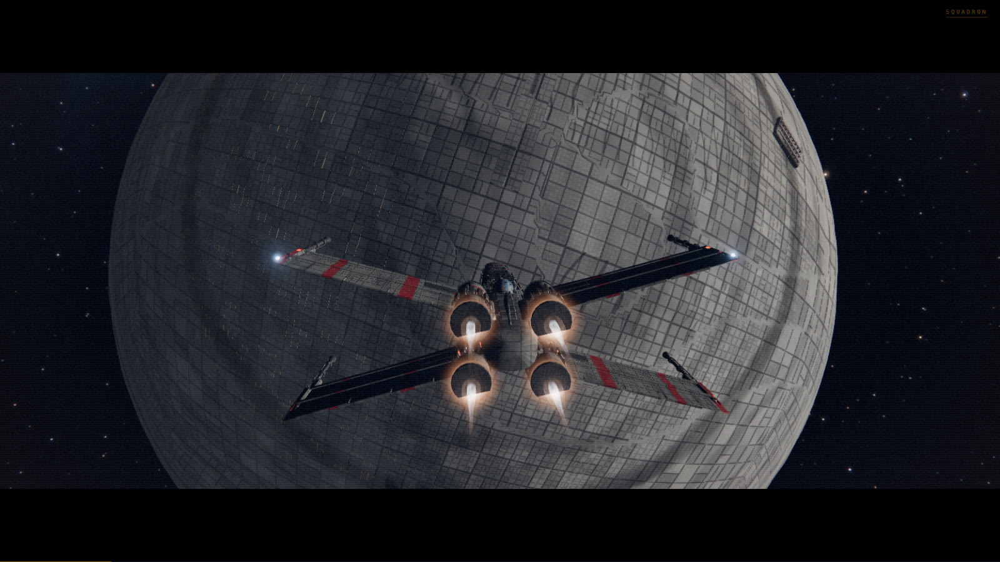<br>
  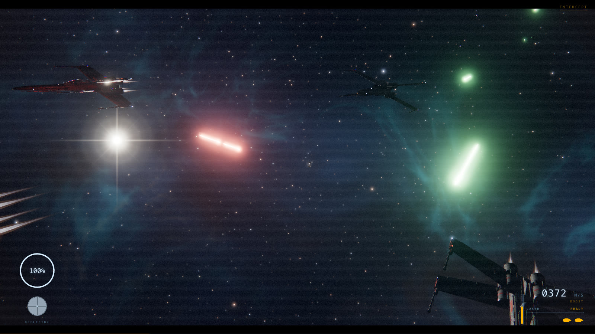
  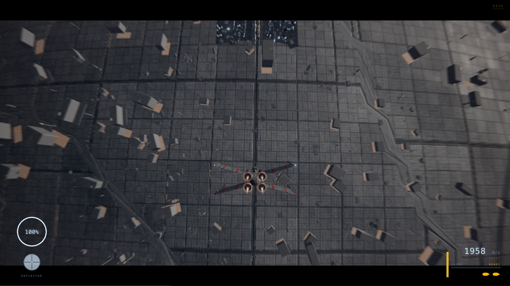<br>
  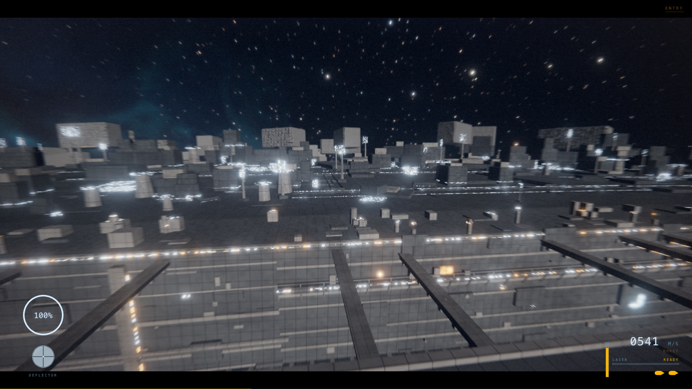
  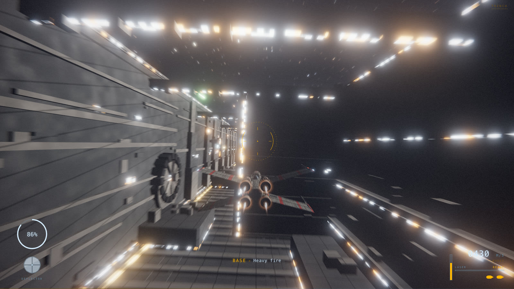<br>
  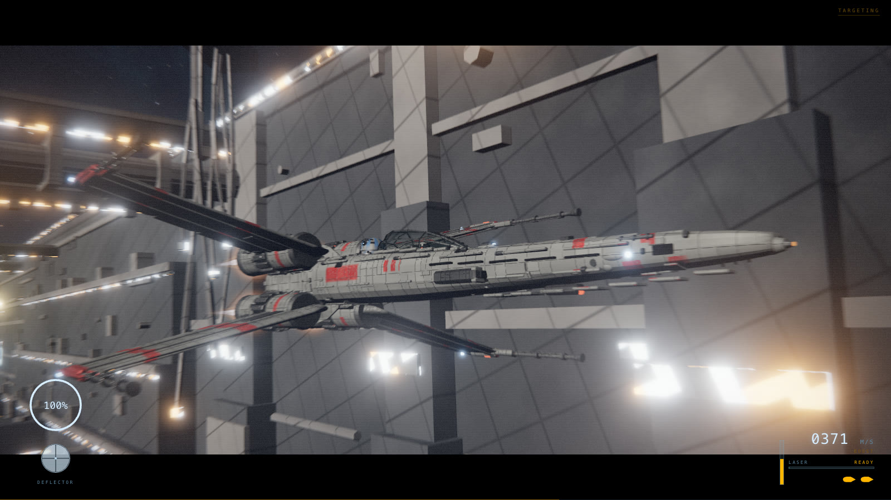
  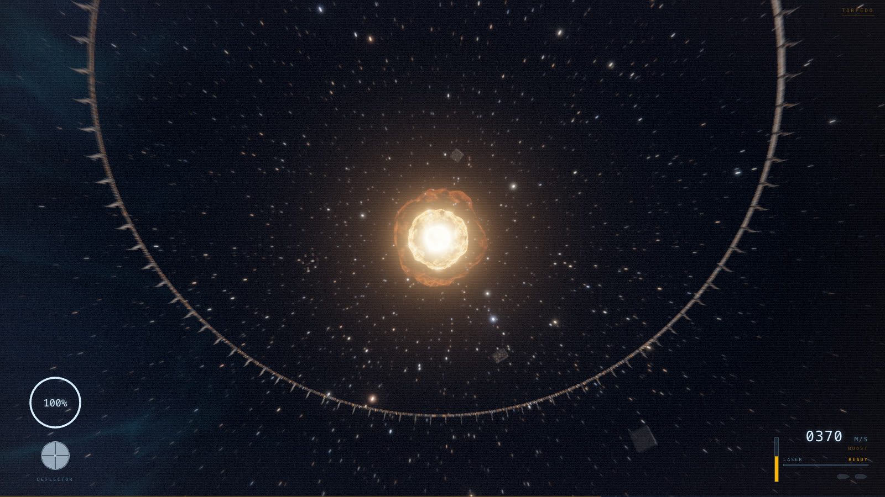<br>
  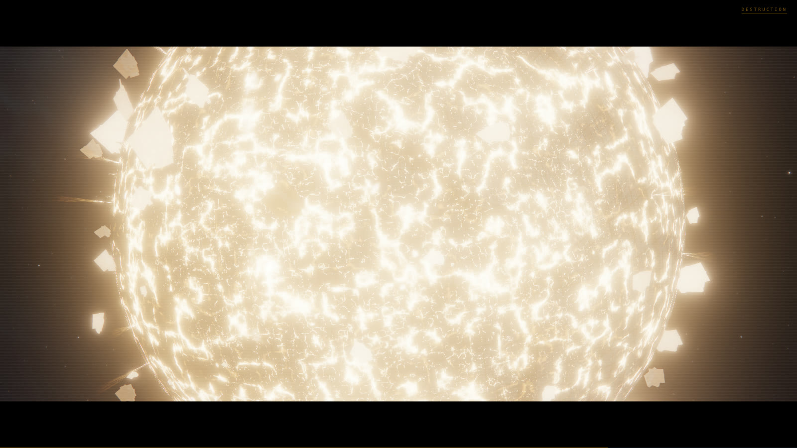
  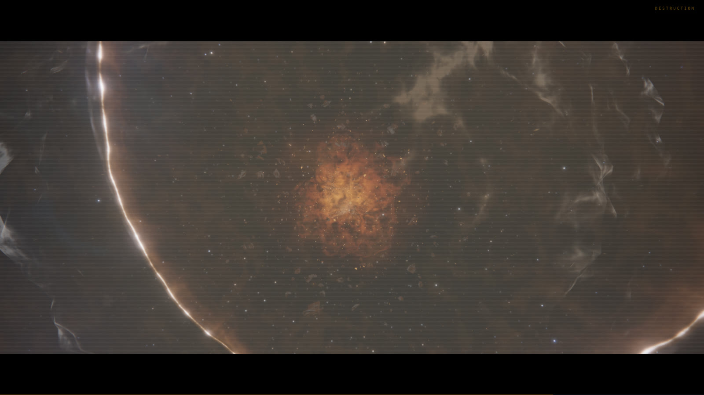<br>
  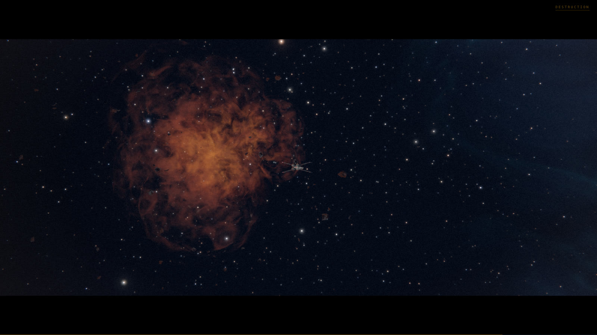
  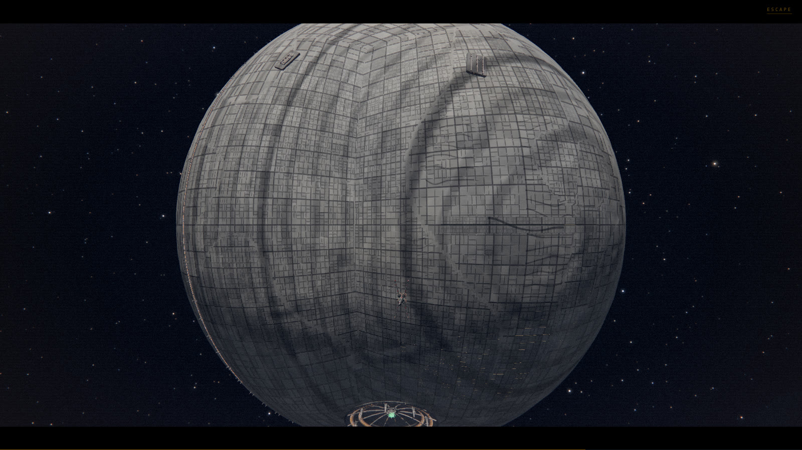
</p>

---

## The sequence

Twelve phases and thirty camera shots, driven by a director that cross-blends between
them. Runtime 3:12 in cinematic mode:

| | | |
|---|---|---|
| 0:00 | **Approach** | Wide on the station, the squadron flies into frame |
| 0:18 | **Squadron** | Tracking alongside, S-foils lock in attack position |
| 0:35 | **Intercept** | Rolling TIE waves, head-on passes, wingmen firing |
| 0:59 | **Dive** | 30 km to 900 m, the surface rushing up |
| 1:15 | **Entry** | Over the deck and down into the trench |
| **1:22** | **Trench run** | **Playable.** 21 km, turbolasers, spans, wingmen picked off |
| 2:10 | **Targeting** | The port ahead, lock building |
| 2:19 | **Torpedoes** | Two torpedoes down the trench and into the shaft |
| 2:29 | **Escape** | Climbing out, the station falling away below |
| 2:40 | **Destruction** | Six stages, twenty seconds |
| 3:02 | **Outro** | Clear of the debris field |

In interactive mode the trench run ends when you reach the port, so a boosted run is shorter.

---

## World scale

1 unit = 1 metre. The X-wing is 12.5 m long. The Death Star is **100 km across** (radius
50 000), centred on the world origin. The playable trench is 30 km long, 124 m wide and
105 m deep.

The trench follows a **great circle**, not a straight line, so the horizon genuinely falls
away ahead of you and the surface curves off to either side. `src/core/constants.ts` owns
the scale and the trench frame (`trenchToWorld` / `trenchQuat` / `worldToTrench`); every
module builds on those, and the flight model reads the trench's real drifting centreline,
width and floor height rather than a nominal box.

---

## Architecture

```
src/
  core/        engine, HDR post stack, seeded RNG, pooling, input, procedural audio
  shaders/     shared GLSL chunk library + laser / torpedo / fireball / shockwave /
               starfield / surface materials
  world/       space environment, Death Star shell + surface LOD, trench streaming,
               shared greeble kit and hull material
  craft/       X-wing (hero + LOD builds), TIE fighters and their steering AI
  fx/          pooled combat VFX, particles, the six-stage destruction event
  game/        flight model, master sequence, HUD
  camera/      shot-based cinematic director + the 30-shot list
qa/            Playwright harnesses: capture, live, verify, video render
```

Roughly 18 000 lines of TypeScript and GLSL. [`CONTRACTS.md`](CONTRACTS.md) is the module
contract the parallel build agents worked to.

**Rendering.** HDR linear → `UnrealBloomPass` → a custom grade pass (chromatic radial
speed blur, lift/gain, vignette, grain, explosion flash) → `OutputPass` with ACES filmic
tone mapping and correct sRGB. Emissive values above 1.0 bloom: laser cores sit around
20-40, the fireball core above 40.

**Procedural detail.** The station shell is a cube-sphere (no pole singularity, since the
trench crosses the polar region) with holes cut for the meridian trench, the equatorial
trench and the superlaser crater, plus distance-driven `InstancedMesh` greeble rings so the
surface gains real geometry as you descend. The trench streams 250 m modular segments
composed from seeded wall, floor and prop variants, arranged so no combination repeats
inside 320 segments.

---

## Measured

Apple M5 Pro, headless Chrome (ANGLE/Metal), 1600×900:

| phase | fps | draw calls | triangles |
|---|---|---|---|
| approach | 81 | 57 | 0.55 M |
| intercept | 86 | 80 | 1.17 M |
| dive to surface | 70 | 116 | 1.93 M |
| trench run | 98-110 | 110-120 | 1.9-2.0 M |
| targeting / torpedoes | 93-115 | 120-122 | 2.0 M |
| destruction (fireball peak) | 41 | 46 | 0.20 M |
| outro | 70 | 36 | 0.11 M |

The fireball peak is fill-rate bound (nested full-screen additive shells) and the engine's
adaptive quality drops the render scale to hold the frame rate there. Production bundle is
971 kB, 274 kB gzipped, essentially all of it Three.js.

---

## Verification

```bash
node qa/verify.mjs http://localhost:4193/   # full acceptance check
node qa/capture.mjs                         # deterministic seek + screenshot per milestone
node qa/live.mjs                            # real-time run with fps sampling
node qa/render-video.mjs                    # re-render the highlight reel
```

`qa/verify.mjs` runs against the production build and asserts the whole thing. Last run:

```
phases reached: approach squadron intercept dive entry trench targeting
                torpedo escape destruction outro end          (12 / 12)
shots reached : 30 / 30
console errors: none
interactive   : steer ✓  boost 430 → 604 m/s ✓  lasers ✓  trench ceiling ✓
```

Frames come from stepping the sequence with a fixed 1/30 s timestep through
`window.__demo.seek`, so captures and the video are deterministic rather than screen
recordings. `qa/sequence-contact-sheet.png` tiles a full playthrough into one image.

### Defects the visual QA passes caught

Recorded because they are the interesting part, and because builders should not grade their
own work quietly:

- **Every PBR surface was emitting full white.** Three.js seeds
  `totalEmissiveRadiance = emissive`, so a material that adds masked emissive in
  `onBeforeCompile` must keep `emissive` black. Two modules had it wrong and the whole
  scene was washed out until it was found.
- **The dogfight was impossible.** The ship flew the intercept at 1600 m/s against 380 m/s
  TIEs, so they trailed 20 km behind and never engaged. Separately, `spread` turned out to
  be a slot multiplier rather than a distance, which had scattered them 27 km apart.
- **Exponential smoothing in world space trails a fast subject by `v / lambda`** - 70 m for
  the chase camera at trench speed, 1.4 km for the wingmen at approach speed, which is why
  the squadron never appeared on camera. Both now advect with the leader's velocity before
  damping.
- **Several shots passed an up vector parallel to the view axis**, giving degenerate
  framing.
- **A hole in the station.** The shell cuts the trench corridor out and the trench only
  streams near the player, so from orbit you saw straight through it.
- **The ship overshot the exhaust port** before the torpedoes fired, and the torpedo curve
  flew them up out of the trench and back in.

Still imperfect: the fireball peak at destruction +6 s runs hot, close to blowing the frame
to white, though it keeps visible ejecta, wreckage and colour at the fringe. The shockwave
front decelerates rather than expanding to 28 station radii; at that speed it crosses the
camera band in under half a second and is unfilmable.

---

## License and attribution

Code and generated assets: [MIT](../LICENSE).

This is an unaffiliated homage. *Star Wars*, X-wing, TIE fighter and the Death Star are
trademarks of Lucasfilm Ltd. **No film footage, audio, models or textures are used or
redistributed here** - the reference clip informed the shot list and the look, and
everything in this directory is procedurally generated by the code beside it.
